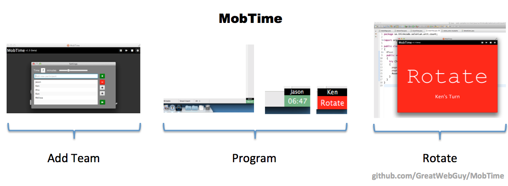

# MobTime
Mob timer written in JavaFX

For Timing Mob Sessions

### Build
#### Requirements
- Gradle 6.x
- OpenJDK 14
- Jmods for JavaFX 14

#### Windows
- enable .net framework 3.5.1 on Windows 10
- Install WIX build tools
- Update paths in gradle.properties to match location of jdk and jmods

#### MacOS
- Update paths in gradle.properties to match location of jdk and jmods

#### Linux (Ubuntu)
- Update paths in gradle.properties to match location of jdk and jmods

### Package generation
> MacOSX
> ```./gradlew jpackage -PinstallerType=pkg```

> Windows
> ```gradlew.bat jpackage -PinstallerType=msi```

> Linux (Ubuntu)
> ```./gradlew jpackage -PinstallerType=deb```

### Use
- Download the MacOSX, Windows, or Linux (Ubuntu/Debian) installer, install and run
- Default time is 7 minutes
- Click center of screen to start timer

#### Toolbar
 * Pause to pause current user
 * Skip to skip to the next user
 * Stop to stop rotate nag alarm or current users turn
 * Settings - Add/Remove users for named rotation and Skip/Reorders users 
 
#### Secret Menu
 * If a user is called `break` it will function as a break
 * If you add an environment variable such as `export MOBTIME_SCRIPT=/Users/jason-crow/{name}.py` it will run that file if it exists for current person
 




[http://greatwebguy.github.io/MobTime/](http://greatwebguy.github.io/MobTime/)
